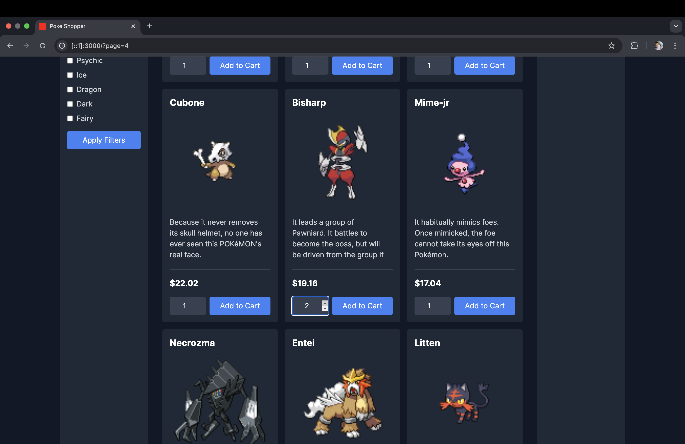
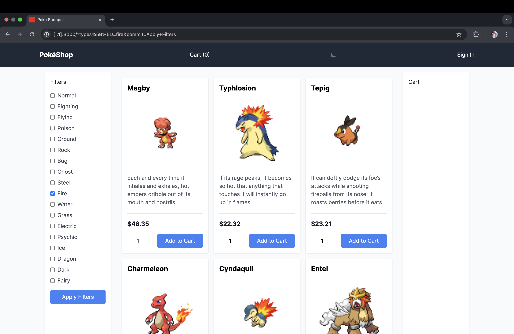
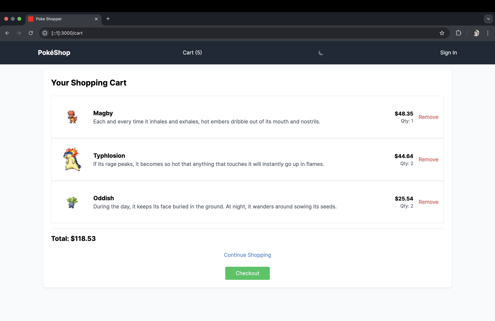
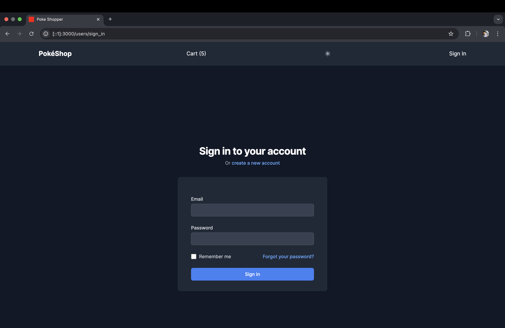
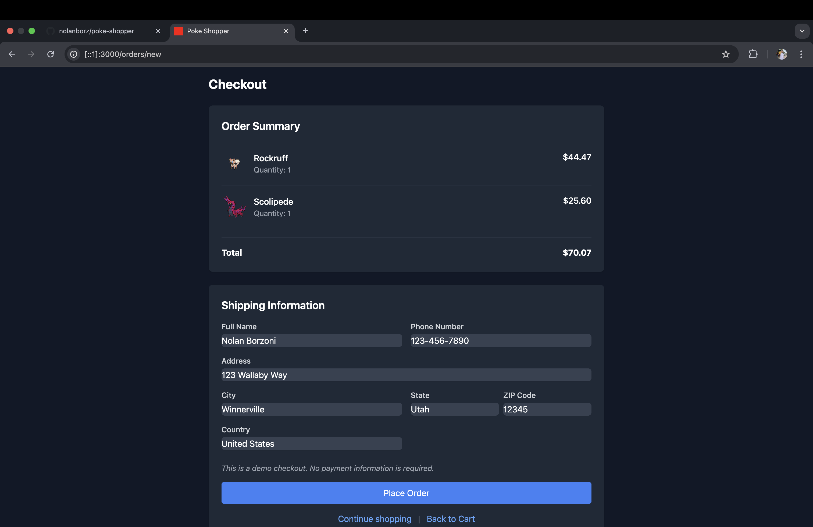
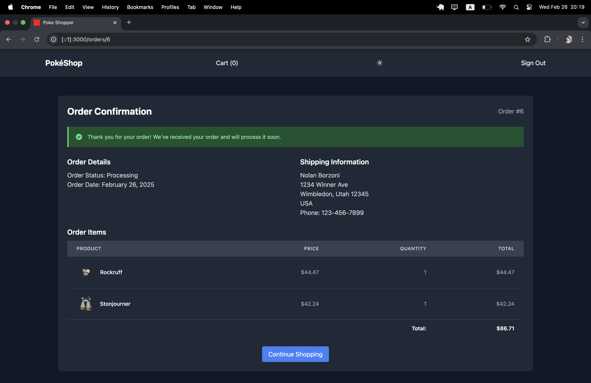

# README

# Poke Shopper

A Pokemon team-building application that lets users collect and battle Pokemon using an innovative points-based system.

## Features
- Browse and purchase Pokemon using the PokeAPI integration
- Dynamic Pokemon generation and display
- Shopping cart and checkout system
- [Any other key features]

## Tech Stack
- Ruby on Rails
- TailwindCSS 
- PostgreSQL
- PokeAPI integration

## Future Development
- Implementing PokePoints currency system
- Team building mechanics (6 Pokemon limit)
- Team rating algorithm
- PvP battle system
- [Other planned features]

## Installation & Setup
[Add local development setup instructions]

## Features Showcase

*Users can select quantity of Pokemon they wish to purchase (dark mode is also enabled)

*Users can filter which types of Pokemon they want to see

*Ability to remove items from cart

*Sign in using Devise authentication

*Enter shipping information on the order page

*Receive order confirmation once the order is placed
